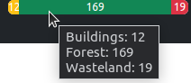
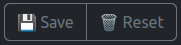
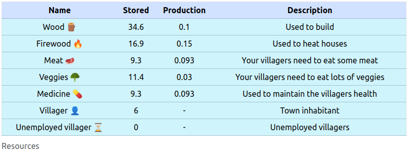
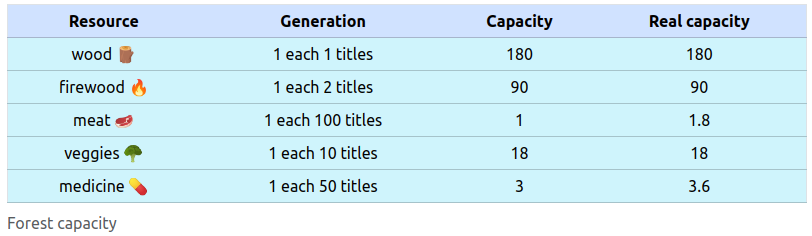
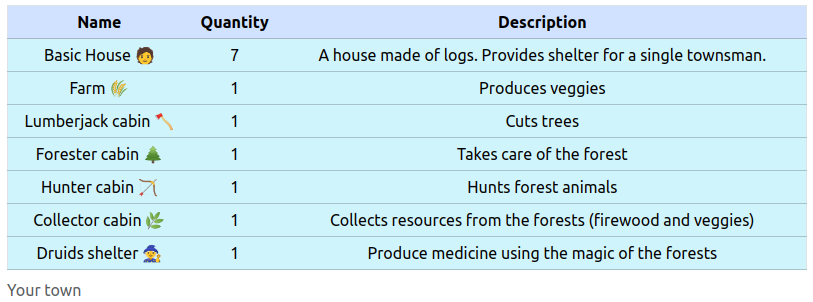
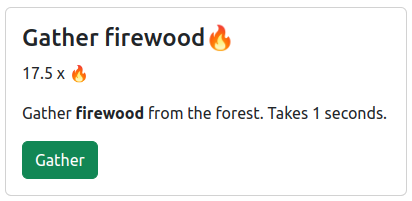
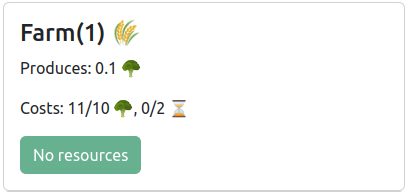
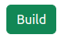

# 1. Table of contents

- [1. Table of contents](#1-table-of-contents)
- [2. Eco Town Tycoon](#2-eco-town-tycoon)
- [3. Menu](#3-menu)
  - [3.1. Main menu](#31-main-menu)
  - [3.2. World composition](#32-world-composition)
  - [3.3. Save and Reset](#33-save-and-reset)
- [4. World](#4-world)
  - [4.1. Forest](#41-forest)
    - [4.1.1. How-to regenerate the forest](#411-how-to-regenerate-the-forest)
  - [4.2. Wasteland](#42-wasteland)
  - [4.3. Buildings](#43-buildings)
- [5. Summary](#5-summary)
  - [5.1. Resources](#51-resources)
  - [5.2. Forest capacity](#52-forest-capacity)
  - [5.3. Your town](#53-your-town)
- [6. Forest](#6-forest)
- [7. Town](#7-town)

# 2. Eco Town Tycoon

A a game built in javascript that consists in growing the population to the maximum given the ecological restraints of the environment.

# 3. Menu

The menu allows the user to navigate through the game itself and provides access to the submenus and information.

## 3.1. Main menu

Provides access to the **Summary**, the **Forest**, the **Town** and the about page (this one).

## 3.2. World composition

Shows the World composition.

## 3.3. Save and Reset

# 4. World

The world has a fixed size. It is divided in:
* Forest
* Wasteland
* Buildings

## 4.1. Forest

The forest provides basic resources for your townsmen such as wood, meat, medicines, firewood, ... Those resources are available to be gathered and renew themselves automatically.

However, every resource requires certain forest size to grow. For example, wood and firewood require very little space, but animals (meat) and medicine require huge terrain.

### 4.1.1. How-to regenerate the forest

Every time you or your villagers cut down a tree, a forest tile is converted into a wasteland tile. The wasteland tile can be used to build a building, but most of the time you will want to regenerate the forest tile.

The foresters are special villagers that take care of the forest for you. They plant trees in the empty wasteland tiles so they can grow back.

## 4.2. Wasteland

Empty space available to build, it also can be used to regenerate the forest.

## 4.3. Buildings

The core of your town. You'll need buildings to provide shelter for your townsmen, or to develop some activities such as farming.

# 5. Summary

## 5.1. Resources

Resources are needed to build buildings, or to provide basic requirements for villagers.

| Resource | Description | Building | Forest action? |
| --- | ---- | --- | -- |
| **Wood** 🪵 | Used to build buildings | Lumberjack cabin | Yes |
| **Firewood** 🔥 | Used to heat houses | Collector cabin | Yes |
| **Meat** 🥩 | Your villagers need to eat some meat | Hunter cabin | Yes |
| **Veggies** 🥦 | Your villagers need to eat lots of veggies | Farm | No |
| **Medicine** 💊 | Used to maintain the villagers health | Druids shelter | Yes |
| **Villagers** 👤 | Your town size | Basic house | No |
| **Unemployed** ⏳ | Required to operate buildings | Basic house | No |

 

## 5.2. Forest capacity

Informs the user about the required number of forest tiles to generate a unit of resource.

## 5.3. Your town

Shows the number of buildings in your town.

# 6. Forest

Here you can execute manual actions to obtain resources from the forest. In the image below the button to gather firewood is shown.

The title shows the action and the resource icon (**Gather firewood** 🔥).

The first paragraph shows the current quantity of the given resource (17.5 x 🔥)

The second paragraph shows a description and how much time the action takes.

At the bottom, there is the button to execute the action.

# 7. Town

Here you can build buildings to automate production with villagers.

The title shows the building, the number of buildings this type you have in your town, and its icon (🌾).

The first paragraph shows what the building produces (0.1 🥦).

The second paragraph shows the resource requirements for building it and the actual quantity of those resources (Costs: 11/10 🥦, 0/2 ⏳ == 10 veggies and 2 unemployed).

Prior to build a building, you must have a tile of wasteland available.

The button will show `Build` if you fulfill all requirements or `No resources` if not.

| Can be built | Can not |
| -- | -- |
|  |  |
